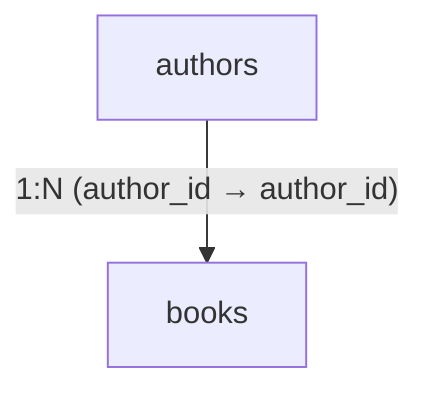

# Bank soal lengkap Quethink — 6 Oktober 2026

Versi revisi: 10 soal pre-test diagnostik, 45 latihan, dan 16 soal post-test (10 konsep + 6 kasus SQL). Dokumen berisi soal, data sintetis publik, pilihan/blok, dan kriteria tugas. Tidak memuat kunci jawaban atau varian pengujian privat. Riwayat hasil pengguna tetap disimpan.

Status 8 Oktober 2026: revisi sepuluh soal pre-test yang lebih jelas beserta tabel acuannya sudah diterapkan melalui MCP Supabase. Atas instruksi eksplisit pengguna, satu sesi akun yang masih aktif ditutup sebagai ABANDONED sebelum revisi; riwayat tidak dihapus, nilai lama tidak diubah, dan tes harus dimulai ulang. Guard penolakan perubahan saat ada sesi aktif tetap ada pada migration. Revisi latihan dan post-test sebelumnya tidak berubah.

## Pre-test — naskah jelas, 8 Oktober 2026

Jawab sesuai pengetahuan awal; pilih Belum tahu jika belum mengetahui. Tidak ada batas kelulusan atau kontribusi pada nilai akhir. Tabel pendukung selalu tampil bersama soal, sebelum pilihan jawaban, tanpa label kunci PK/FK atau diagram yang membocorkan jawaban. Data mengikuti registry sintetis aplikasi.

### 1. Mengenali kolom

Perhatikan tabel `books` di bawah. Petugas ingin mengambil **judul buku**, bukan nomor buku atau jumlah stok.

**Kolom mana yang menyimpan judul buku?**

**Data acuan: Katalog Buku (keadaan awal)**

**books**

| book_id | title | author_id | stock |
| --- | --- | --- | --- |
| 10 | Dasar Basis Data | 1 | 5 |
| 20 | Logika Data | 1 | 0 |
| 30 | Algoritma Ringkas | 2 | 3 |
| 40 | Pengantar SQL | 3 | 2 |

**Pilihan jawaban**

- title
- book_id
- stock
- Belum tahu

### 2. Memilih identitas record

Tabel `students` menyimpan data mahasiswa. Nama dan angkatan boleh sama untuk beberapa mahasiswa. Nomor `student_id` diberikan kepada satu mahasiswa dan tidak boleh kosong.

Petugas perlu memilih satu mahasiswa secara tepat tanpa tertukar. **Kolom mana yang paling sesuai dijadikan primary key atau identitas unik setiap mahasiswa?**

**Data acuan: Kampus Mini (keadaan awal)**

**students**

| student_id | name | cohort |
| --- | --- | --- |
| 1 | Alya | 2025 |
| 2 | Bima | 2025 |
| 3 | Citra | 2024 |
| 4 | Danu | 2024 |

**Pilihan jawaban**

- name
- student_id
- cohort
- Belum tahu

### 3. Memahami hubungan antartabel

Perpustakaan menyimpan data buku dalam `books` dan data penulis dalam `authors`.

Buku **Algoritma Ringkas** memiliki `author_id = 2`. Pada tabel `authors`, nomor tersebut dimiliki oleh **Budi**.

**Mengapa tabel buku menyimpan `author_id`?**

**Data acuan: Katalog Buku (keadaan awal)**

**authors**

| author_id | name | city |
| --- | --- | --- |
| 1 | Rani | Bandung |
| 2 | Budi | Surabaya |
| 3 | Sinta | Bandung |

**books**

| book_id | title | author_id | stock |
| --- | --- | --- | --- |
| 10 | Dasar Basis Data | 1 | 5 |
| 20 | Logika Data | 1 | 0 |
| 30 | Algoritma Ringkas | 2 | 3 |
| 40 | Pengantar SQL | 3 | 2 |

**Pilihan jawaban**

- Untuk menentukan urutan buku berdasarkan judul.
- Untuk menyimpan jumlah stok buku.
- Untuk menghubungkan setiap buku dengan data penulisnya.
- Belum tahu

### 4. Menampilkan satu kolom

Petugas ingin menampilkan **judul seluruh buku** dari tabel `books`. Hasilnya harus memiliki satu kolom saja, yaitu `title`.

**Query mana yang memenuhi kebutuhan tersebut?**

**Data acuan: Katalog Buku (keadaan awal)**

**books**

| book_id | title | author_id | stock |
| --- | --- | --- | --- |
| 10 | Dasar Basis Data | 1 | 5 |
| 20 | Logika Data | 1 | 0 |
| 30 | Algoritma Ringkas | 2 | 3 |
| 40 | Pengantar SQL | 3 | 2 |

**Pilihan jawaban**

- SELECT title FROM books;
- SELECT title, stock FROM books;
- SELECT * FROM books;
- Belum tahu

### 5. Menentukan hasil filter

Perpustakaan hanya akan meminjamkan buku untuk kegiatan kelompok jika stoknya **lebih dari 2**.

Petugas menjalankan query:

```sql
SELECT title
FROM books
WHERE stock > 2;
```

**Judul buku mana saja yang masuk dalam hasil query? Abaikan urutan hasilnya.**

**Data acuan: Katalog Buku (keadaan awal)**

**books**

| book_id | title | author_id | stock |
| --- | --- | --- | --- |
| 10 | Dasar Basis Data | 1 | 5 |
| 20 | Logika Data | 1 | 0 |
| 30 | Algoritma Ringkas | 2 | 3 |
| 40 | Pengantar SQL | 3 | 2 |

**Pilihan jawaban**

- Dasar Basis Data dan Pengantar SQL.
- Dasar Basis Data dan Algoritma Ringkas.
- Algoritma Ringkas dan Pengantar SQL.
- Belum tahu

### 6. Menggabungkan data buku dan penulis

Petugas ingin membuat laporan yang menampilkan **judul buku beserta nama penulisnya**.

Judul tersedia di tabel `books`, sedangkan nama penulis tersedia di tabel `authors`.

**Kondisi JOIN mana yang memasangkan buku dengan penulis yang benar?**

**Data acuan: Katalog Buku (keadaan awal)**

**authors**

| author_id | name | city |
| --- | --- | --- |
| 1 | Rani | Bandung |
| 2 | Budi | Surabaya |
| 3 | Sinta | Bandung |

**books**

| book_id | title | author_id | stock |
| --- | --- | --- | --- |
| 10 | Dasar Basis Data | 1 | 5 |
| 20 | Logika Data | 1 | 0 |
| 30 | Algoritma Ringkas | 2 | 3 |
| 40 | Pengantar SQL | 3 | 2 |

**Pilihan jawaban**

- books.title = authors.name
- books.book_id = authors.author_id
- books.author_id = authors.author_id
- Belum tahu

### 7. Menghitung record

Setiap baris pada tabel `books` mewakili **satu judul buku**. Kolom `stock` menunjukkan jumlah eksemplar yang tersedia.

Petugas menjalankan:

```sql
SELECT COUNT(*)
FROM books;
```

**Angka berapa yang dihasilkan query tersebut?**

**Data acuan: Katalog Buku (keadaan awal)**

**books**

| book_id | title | author_id | stock |
| --- | --- | --- | --- |
| 10 | Dasar Basis Data | 1 | 5 |
| 20 | Logika Data | 1 | 0 |
| 30 | Algoritma Ringkas | 2 | 3 |
| 40 | Pengantar SQL | 3 | 2 |

**Pilihan jawaban**

- 4
- 10
- 3
- Belum tahu

### 8. Menambahkan record baru

Perpustakaan menerima judul baru bernama **Belajar SQL** yang belum ada dalam tabel `books`.

Petugas ingin **menambahkan satu baris baru**, tanpa mengubah atau menghapus buku yang sudah tercatat.

**Perintah SQL mana yang digunakan?**

**Data acuan: Katalog Buku (keadaan awal)**

**books**

| book_id | title | author_id | stock |
| --- | --- | --- | --- |
| 10 | Dasar Basis Data | 1 | 5 |
| 20 | Logika Data | 1 | 0 |
| 30 | Algoritma Ringkas | 2 | 3 |
| 40 | Pengantar SQL | 3 | 2 |

**Pilihan jawaban**

- UPDATE
- INSERT INTO
- SELECT
- Belum tahu

### 9. Mengubah satu record

Stok **Algoritma Ringkas**, dengan `book_id = 30`, bertambah dari **3 menjadi 4**.

Petugas harus memperbarui stok buku tersebut. Stok semua buku lainnya harus tetap sama.

**Query mana yang tepat?**

**Data acuan: Katalog Buku (keadaan awal)**

**books**

| book_id | title | author_id | stock |
| --- | --- | --- | --- |
| 10 | Dasar Basis Data | 1 | 5 |
| 20 | Logika Data | 1 | 0 |
| 30 | Algoritma Ringkas | 2 | 3 |
| 40 | Pengantar SQL | 3 | 2 |

**Pilihan jawaban**

- UPDATE books SET stock = 4;
- UPDATE books SET stock = 4 WHERE author_id = 1;
- UPDATE books SET stock = 4 WHERE book_id = 30;
- Belum tahu

### 10. Memeriksa target sebelum menghapus

Perpustakaan akan menghapus **Logika Data**, dengan `book_id = 20`, dari katalog.

Sebelum menjalankan DELETE, petugas ingin memastikan bahwa kondisi penghapusan memilih **buku itu saja**, tanpa memilih buku lain.

**Query SELECT mana yang sebaiknya digunakan untuk memeriksa target?**

**Data acuan: Katalog Buku (keadaan awal)**

**books**

| book_id | title | author_id | stock |
| --- | --- | --- | --- |
| 10 | Dasar Basis Data | 1 | 5 |
| 20 | Logika Data | 1 | 0 |
| 30 | Algoritma Ringkas | 2 | 3 |
| 40 | Pengantar SQL | 3 | 2 |

**authors**

| author_id | name | city |
| --- | --- | --- |
| 1 | Rani | Bandung |
| 2 | Budi | Surabaya |
| 3 | Sinta | Bandung |

**Pilihan jawaban**

- SELECT * FROM books WHERE book_id = 20;
- SELECT * FROM books WHERE author_id = 1;
- SELECT * FROM books WHERE stock > 0;
- Belum tahu

## Latihan per materi

Data soal selalu keadaan awal, terpisah dari perubahan salinan Lab. Satu latihan inti per materi wajib; latihan lain opsional dan dapat diulang.

## Materi: membaca bentuk data

**Latihan opsional**

### 1. Temukan tabel yang tepat

Petugas akademik ingin melihat daftar mahasiswa beserta nama dan angkatannya, bukan daftar mata kuliah atau pendaftaran.

Perhatikan tiga tabel Kampus Mini di bawah. **Tabel mana yang menyimpan satu record untuk setiap mahasiswa?** Pilih satu jawaban.

**Data acuan: Kampus Mini (keadaan awal)**

**students**

| student_id | name | cohort |
| --- | --- | --- |
| 1 | Alya | 2025 |
| 2 | Bima | 2025 |
| 3 | Citra | 2024 |
| 4 | Danu | 2024 |

**enrollments**

| enrollment_id | student_id | course_id | score |
| --- | --- | --- | --- |
| 1 | 1 | 10 | 88 |
| 2 | 1 | 20 | 90 |
| 3 | 2 | 10 | 74 |
| 4 | 2 | 30 | 82 |
| 5 | 3 | 20 | 80 |
| 6 | 4 | 10 | 95 |

**courses**

| course_id | course_code | course_name | credits |
| --- | --- | --- | --- |
| 10 | SI101 | Sistem Informasi | 3 |
| 20 | IF102 | Basis Data | 3 |
| 30 | IF103 | Matematika Diskrit | 3 |


**Pilihan jawaban**

- courses
- students
- enrollments

**Latihan opsional**

### 2. Kolom atau nilai?

Pada tabel `students`, setiap baris memuat seorang mahasiswa. Header tabel menjelaskan atribut, sedangkan sel memuat nilai atribut tersebut.

**Manakah nama kolom pada tabel students, bukan nama mahasiswa atau nilai angkatan?** Pilih satu jawaban.

**Data acuan: Kampus Mini (keadaan awal)**

**students**

| student_id | name | cohort |
| --- | --- | --- |
| 1 | Alya | 2025 |
| 2 | Bima | 2025 |
| 3 | Citra | 2024 |
| 4 | Danu | 2024 |


**Pilihan jawaban**

- Alya
- cohort
- 2025

**Latihan inti**

### 3. Bedakan isi dan struktur

Bagian akademik menambahkan mahasiswa baru: `student_id = 5`, `name = Eka`, dan `cohort = 2026`. Mahasiswa tersebut disimpan pada tabel `students` yang sudah ada, dengan atribut yang sama seperti mahasiswa lainnya.

**Apa yang berubah pada tabel setelah record itu ditambahkan?** Pilih satu jawaban. Ini merupakan situasi yang perlu kamu pikirkan; data di bawah masih menunjukkan keadaan awal.

**Data acuan: Kampus Mini (keadaan awal)**

**students**

| student_id | name | cohort |
| --- | --- | --- |
| 1 | Alya | 2025 |
| 2 | Bima | 2025 |
| 3 | Citra | 2024 |
| 4 | Danu | 2024 |


**Pilihan jawaban**

- Jumlah kolom bertambah menjadi empat.
- Jumlah record bertambah; kolom tetap student_id, name, cohort.
- Setiap mahasiswa harus dibuatkan tabel sendiri.

**Latihan opsional**

### 4. Baca struktur katalog buku

Perpustakaan menyimpan judul dan stok setiap buku pada tabel `books`. Perhatikan header dan record buku pertama.

**Pernyataan mana yang tepat membedakan nama kolom dari nilai di dalam kolom tersebut?** Pilih satu jawaban.

**Data acuan: Katalog Buku (keadaan awal)**

**books**

| book_id | title | author_id | stock |
| --- | --- | --- | --- |
| 10 | Dasar Basis Data | 1 | 5 |
| 20 | Logika Data | 1 | 0 |
| 30 | Algoritma Ringkas | 2 | 3 |
| 40 | Pengantar SQL | 3 | 2 |


**Pilihan jawaban**

- Dasar Basis Data adalah kolom; title adalah nilainya.
- title adalah kolom; Dasar Basis Data adalah salah satu nilainya.
- stock adalah satu record lengkap.

## Materi: key dan hubungan antar tabel

**Latihan opsional**

### 1. Identitas bukan nama

Daftar mahasiswa dapat memuat dua orang dengan nama dan angkatan yang sama. Setiap mahasiswa tetap harus dapat dikenali sebagai record yang berbeda.

**Kolom mana pada students digunakan sebagai primary key untuk membedakan record, meskipun nama mahasiswa berulang?** Pilih satu jawaban.

**Data acuan: Kampus Mini (keadaan awal)**

**students**

| student_id | name | cohort |
| --- | --- | --- |
| 1 | Alya | 2025 |
| 2 | Bima | 2025 |
| 3 | Citra | 2024 |
| 4 | Danu | 2024 |


**Pilihan jawaban**

- name
- student_id
- cohort

**Latihan opsional**

### 2. Ikuti foreign key

Pendaftaran dengan `enrollment_id = 2` menyimpan `course_id = 20`. Kamu perlu menemukan mata kuliah yang diikuti pada tabel `courses`.

**Kolom mana di courses menjadi tujuan rujukan foreign key course_id pada pendaftaran tersebut?** Pilih satu jawaban.

**Data acuan: Kampus Mini (keadaan awal)**

**enrollments**

| enrollment_id | student_id | course_id | score |
| --- | --- | --- | --- |
| 1 | 1 | 10 | 88 |
| 2 | 1 | 20 | 90 |
| 3 | 2 | 10 | 74 |
| 4 | 2 | 30 | 82 |
| 5 | 3 | 20 | 80 |
| 6 | 4 | 10 | 95 |

**courses**

| course_id | course_code | course_name | credits |
| --- | --- | --- | --- |
| 10 | SI101 | Sistem Informasi | 3 |
| 20 | IF102 | Basis Data | 3 |
| 30 | IF103 | Matematika Diskrit | 3 |


**Pilihan jawaban**

- courses.enrollment_id
- courses.course_code
- courses.course_id

**Latihan opsional**

### 3. Telusuri pendaftaran Alya

Kamu memeriksa pendaftaran dengan `enrollment_id = 2` untuk mengetahui siapa mahasiswanya dan apa mata kuliahnya.

**Susun langkah penelusuran dalam urutan: baca pendaftaran → cari mahasiswa → cari mata kuliah.** Untuk soal ini, telusuri mahasiswa terlebih dahulu agar urutan pemeriksaan konsisten; kedua rujukan sebenarnya bisa diperiksa secara terpisah.

**Data acuan: Kampus Mini (keadaan awal)**

**students**

| student_id | name | cohort |
| --- | --- | --- |
| 1 | Alya | 2025 |
| 2 | Bima | 2025 |
| 3 | Citra | 2024 |
| 4 | Danu | 2024 |

**enrollments**

| enrollment_id | student_id | course_id | score |
| --- | --- | --- | --- |
| 1 | 1 | 10 | 88 |
| 2 | 1 | 20 | 90 |
| 3 | 2 | 10 | 74 |
| 4 | 2 | 30 | 82 |
| 5 | 3 | 20 | 80 |
| 6 | 4 | 10 | 95 |

**courses**

| course_id | course_code | course_name | credits |
| --- | --- | --- | --- |
| 10 | SI101 | Sistem Informasi | 3 |
| 20 | IF102 | Basis Data | 3 |
| 30 | IF103 | Matematika Diskrit | 3 |


**Blok yang perlu disusun (urutan tampilan, bukan kunci jawaban)**

- Ikuti course_id 20 ke courses: Basis Data.
- Baca enrollment #2: student_id 1 dan course_id 20.
- Ikuti student_id 1 ke students: Alya.

**Latihan opsional**

### 4. Ikuti detail pesanan Nadia

Nadia memiliki pesanan dengan `order_id = 100` dan `300`. Pesanan 100 memuat Buku Catatan dan Pulpen pada dua record detail yang berbeda.

**Mengapa struktur tabel ini memungkinkan satu pesanan memuat beberapa produk tanpa menambah kolom produk baru di orders?** Pilih satu penjelasan berdasarkan tabel `order_items`.

**Data acuan: Toko Mini (keadaan awal)**

**customers**

| customer_id | name | city |
| --- | --- | --- |
| 1 | Nadia | Bandung |
| 2 | Raka | Jakarta |
| 3 | Lina | Bandung |

**orders**

| order_id | customer_id | status |
| --- | --- | --- |
| 100 | 1 | paid |
| 200 | 2 | pending |
| 300 | 1 | paid |

**order_items**

| item_id | order_id | product_id | quantity |
| --- | --- | --- | --- |
| 1 | 100 | 10 | 2 |
| 2 | 100 | 20 | 3 |
| 3 | 200 | 30 | 1 |
| 4 | 300 | 20 | 2 |

**products**

| product_id | name | price |
| --- | --- | --- |
| 10 | Buku Catatan | 15000 |
| 20 | Pulpen | 5000 |
| 30 | Tas | 80000 |


**Pilihan jawaban**

- customers menyimpan semua produk pada kolom name.
- order_items merujuk order_id dan product_id; setiap baris adalah satu detail produk dalam pesanan.
- Baris pertama setiap tabel selalu saling berhubungan.

**Latihan inti**

### 5. Model Peminjaman Buku

Perpustakaan ingin mencatat anggota, buku, dan setiap peminjaman secara terpisah. Seorang anggota dapat melakukan beberapa peminjaman, dan sebuah buku dapat dipinjam pada waktu yang berbeda.

### Tugas
Buat tepat tiga tabel berikut pada editor model:
- `members`: `member_id` bertipe integer sebagai PK, dan `name` bertipe text.
- `books`: `book_id` bertipe integer sebagai PK, dan `title` bertipe text.
- `loans`: `loan_id` bertipe integer sebagai PK, serta `member_id` dan `book_id` bertipe integer.

Hubungkan `loans.member_id` ke `members.member_id` dan `loans.book_id` ke `books.book_id` sebagai foreign key. Jangan tambahkan kolom atau tabel lain. Model ini mencatat satu buku pada setiap record peminjaman; belum mencakup tanggal atau jumlah stok.

## Materi: memilih sumber dan kolom

**Latihan opsional**

### 1. Pilih sumber informasi

Petugas akademik meminta daftar kode dan nama mata kuliah. Ia tidak membutuhkan nama mahasiswa atau nilai pendaftarannya.

**Tabel mana yang tepat menjadi sumber pada klausa FROM?** Pilih satu jawaban berdasarkan kolom pada data di bawah.

**Data acuan: Kampus Mini (keadaan awal)**

**students**

| student_id | name | cohort |
| --- | --- | --- |
| 1 | Alya | 2025 |
| 2 | Bima | 2025 |
| 3 | Citra | 2024 |
| 4 | Danu | 2024 |

**courses**

| course_id | course_code | course_name | credits |
| --- | --- | --- | --- |
| 10 | SI101 | Sistem Informasi | 3 |
| 20 | IF102 | Basis Data | 3 |
| 30 | IF103 | Matematika Diskrit | 3 |

**enrollments**

| enrollment_id | student_id | course_id | score |
| --- | --- | --- | --- |
| 1 | 1 | 10 | 88 |
| 2 | 1 | 20 | 90 |
| 3 | 2 | 10 | 74 |
| 4 | 2 | 30 | 82 |
| 5 | 3 | 20 | 80 |
| 6 | 4 | 10 | 95 |


**Pilihan jawaban**

- students
- courses
- enrollments

**Latihan opsional**

### 2. Pilih atribut

Laporan hanya boleh memuat kode mata kuliah dan nama mata kuliah, dengan kode berada di kolom pertama.

**Bagian SELECT mana yang mengambil tepat dua atribut tersebut dari courses?** Pilih satu jawaban.

**Data acuan: Kampus Mini (keadaan awal)**

**courses**

| course_id | course_code | course_name | credits |
| --- | --- | --- | --- |
| 10 | SI101 | Sistem Informasi | 3 |
| 20 | IF102 | Basis Data | 3 |
| 30 | IF103 | Matematika Diskrit | 3 |


**Pilihan jawaban**

- SELECT *
- SELECT course_code, course_name
- SELECT name, cohort

**Latihan inti**

### 3. Bangun query pertama

Kamu diminta menulis query sederhana yang menampilkan `course_code` lalu `course_name` dari tabel `courses`. Semua mata kuliah ikut ditampilkan; belum diperlukan filter, pengurutan, atau pembatasan hasil.

**Susun dua bagian query: pilihan kolom terlebih dahulu, kemudian tabel sumber.**

**Data acuan: Kampus Mini (keadaan awal)**

**courses**

| course_id | course_code | course_name | credits |
| --- | --- | --- | --- |
| 10 | SI101 | Sistem Informasi | 3 |
| 20 | IF102 | Basis Data | 3 |
| 30 | IF103 | Matematika Diskrit | 3 |


**Blok yang perlu disusun (urutan tampilan, bukan kunci jawaban)**

- FROM courses;
- SELECT course_code, course_name

**Latihan opsional**

### 4. Pilih dua kolom katalog

Perpustakaan membutuhkan daftar judul dan stok buku. Query di bawah memilih dua kolom tersebut; `ORDER BY book_id` hanya menetapkan urutan tampilan dari ID kecil ke besar.

**Prediksi seluruh baris hasil query.** Masukkan `title | stock` pada setiap baris, tanpa header, sesuai urutan hasil. Gunakan data awal tabel `books` di bawah.

**Data acuan: Katalog Buku (keadaan awal)**

**books**

| book_id | title | author_id | stock |
| --- | --- | --- | --- |
| 10 | Dasar Basis Data | 1 | 5 |
| 20 | Logika Data | 1 | 0 |
| 30 | Algoritma Ringkas | 2 | 3 |
| 40 | Pengantar SQL | 3 | 2 |


**Query yang ditinjau**

```sql
SELECT title, stock FROM books ORDER BY book_id;
```

## Materi: menyaring record

**Latihan opsional**

### 1. Uji nilai batas

Pendaftaran dengan `enrollment_id = 5` memiliki `score = 80`. Laporan menerima nilai minimal 80 dengan kondisi `score >= 80`.

**Apakah record ini termasuk hasil filter?** Pilih jawaban yang menjelaskan perlakuan terhadap nilai tepat pada batas.

**Data acuan: Kampus Mini (keadaan awal)**

**enrollments**

| enrollment_id | student_id | course_id | score |
| --- | --- | --- | --- |
| 1 | 1 | 10 | 88 |
| 2 | 1 | 20 | 90 |
| 3 | 2 | 10 | 74 |
| 4 | 2 | 30 | 82 |
| 5 | 3 | 20 | 80 |
| 6 | 4 | 10 | 95 |


**Pilihan jawaban**

- score > 80
- score >= 80
- score < 80

**Latihan opsional**

### 2. Gabungkan dua syarat

Laporan hanya menerima pendaftaran untuk `course_id = 10` yang sekaligus memiliki `score >= 80`. Kedua syarat harus benar pada record yang sama.

**Operator mana yang menggabungkan kedua syarat sesuai permintaan?** Pilih satu jawaban.

**Data acuan: Kampus Mini (keadaan awal)**

**enrollments**

| enrollment_id | student_id | course_id | score |
| --- | --- | --- | --- |
| 1 | 1 | 10 | 88 |
| 2 | 1 | 20 | 90 |
| 3 | 2 | 10 | 74 |
| 4 | 2 | 30 | 82 |
| 5 | 3 | 20 | 80 |
| 6 | 4 | 10 | 95 |


**Pilihan jawaban**

- course_id = 10 OR score >= 80
- course_id = 10 AND score >= 80
- course_id = 10 AND score = 80

**Latihan inti**

### 3. Tentukan record yang lolos

Petugas akademik ingin melihat pendaftaran dengan nilai minimal 80. Query di bawah menampilkan `enrollment_id` dan `score`, diurutkan menurut ID pendaftaran dari kecil ke besar.

**Prediksi seluruh baris hasil query dari data awal enrollments.** Tulis `enrollment_id | score` per baris tanpa header. Nilai tepat 80 ikut dipertimbangkan.

**Data acuan: Kampus Mini (keadaan awal)**

**enrollments**

| enrollment_id | student_id | course_id | score |
| --- | --- | --- | --- |
| 1 | 1 | 10 | 88 |
| 2 | 1 | 20 | 90 |
| 3 | 2 | 10 | 74 |
| 4 | 2 | 30 | 82 |
| 5 | 3 | 20 | 80 |
| 6 | 4 | 10 | 95 |


**Query yang ditinjau**

```sql
SELECT enrollment_id, score FROM enrollments WHERE score >= 80 ORDER BY enrollment_id;
```

**Latihan opsional**

### 4. Temukan stok yang cukup

Perpustakaan mencari buku dengan stok sedikitnya tiga eksemplar. Query di bawah menampilkan judul dan stok, diurutkan menurut `book_id`.

**Prediksi seluruh baris hasil query.** Tulis `title | stock` per baris tanpa header, berdasarkan data awal `books`.

**Data acuan: Katalog Buku (keadaan awal)**

**books**

| book_id | title | author_id | stock |
| --- | --- | --- | --- |
| 10 | Dasar Basis Data | 1 | 5 |
| 20 | Logika Data | 1 | 0 |
| 30 | Algoritma Ringkas | 2 | 3 |
| 40 | Pengantar SQL | 3 | 2 |


**Query yang ditinjau**

```sql
SELECT title, stock FROM books WHERE stock >= 3 ORDER BY book_id;
```

## Materi: mengurutkan dan membatasi

**Latihan opsional**

### 1. Lihat urutan menaik

Petugas akademik ingin memeriksa dua pendaftaran dengan nilai terendah. Query mengurutkan `score` menaik, memakai `enrollment_id` menaik jika nilai sama, lalu mengambil dua baris.

**Prediksi dua baris hasil query.** Tulis `enrollment_id | score` per baris tanpa header dan pertahankan urutannya.

**Data acuan: Kampus Mini (keadaan awal)**

**enrollments**

| enrollment_id | student_id | course_id | score |
| --- | --- | --- | --- |
| 1 | 1 | 10 | 88 |
| 2 | 1 | 20 | 90 |
| 3 | 2 | 10 | 74 |
| 4 | 2 | 30 | 82 |
| 5 | 3 | 20 | 80 |
| 6 | 4 | 10 | 95 |


**Query yang ditinjau**

```sql
SELECT enrollment_id, score FROM enrollments ORDER BY score ASC, enrollment_id ASC LIMIT 2;
```

**Latihan opsional**

### 2. Pecahkan nilai seri

Semua mata kuliah pada data awal memiliki `credits = 3`. Laporan harus mengambil dua mata kuliah dengan kredit terbesar; jika kredit sama, nama mata kuliah diurutkan alfabetis menaik.

**Klausa mana yang memenuhi aturan pemilihan dan menghasilkan urutan yang pasti?** Pilih satu jawaban.

**Data acuan: Kampus Mini (keadaan awal)**

**courses**

| course_id | course_code | course_name | credits |
| --- | --- | --- | --- |
| 10 | SI101 | Sistem Informasi | 3 |
| 20 | IF102 | Basis Data | 3 |
| 30 | IF103 | Matematika Diskrit | 3 |


**Pilihan jawaban**

- LIMIT 2 saja
- ORDER BY credits DESC, course_name ASC LIMIT 2
- ORDER BY credits DESC LIMIT 2

**Latihan inti**

### 3. Temukan dua nilai tertinggi

Laporan penghargaan akademik membutuhkan dua pendaftaran dengan nilai tertinggi. Query mengurutkan `score` menurun, lalu `enrollment_id` menaik jika nilai sama, dan mengambil dua baris.

**Prediksi kedua baris hasil query.** Tulis `enrollment_id | score` per baris tanpa header berdasarkan data awal.

**Data acuan: Kampus Mini (keadaan awal)**

**enrollments**

| enrollment_id | student_id | course_id | score |
| --- | --- | --- | --- |
| 1 | 1 | 10 | 88 |
| 2 | 1 | 20 | 90 |
| 3 | 2 | 10 | 74 |
| 4 | 2 | 30 | 82 |
| 5 | 3 | 20 | 80 |
| 6 | 4 | 10 | 95 |


**Query yang ditinjau**

```sql
SELECT enrollment_id, score FROM enrollments ORDER BY score DESC, enrollment_id ASC LIMIT 2;
```

**Latihan opsional**

### 4. Bandingkan harga produk

Koperasi ingin menampilkan dua produk termahal. Query mengurutkan harga menurun, memakai `product_id` menaik jika harga sama, lalu membatasi hasil menjadi dua baris.

**Prediksi kedua baris hasil query.** Tulis `name | price` per baris tanpa header berdasarkan tabel `products`.

**Data acuan: Toko Mini (keadaan awal)**

**products**

| product_id | name | price |
| --- | --- | --- |
| 10 | Buku Catatan | 15000 |
| 20 | Pulpen | 5000 |
| 30 | Tas | 80000 |


**Query yang ditinjau**

```sql
SELECT name, price FROM products ORDER BY price DESC, product_id ASC LIMIT 2;
```

## Materi: menghubungkan tabel

**Latihan opsional**

### 1. Pasangkan key, bukan urutan

Kamu ingin menggabungkan setiap pendaftaran dengan mahasiswa yang benar. `enrollment_id` adalah identitas pendaftaran, sedangkan `student_id` pada enrollments merujuk seorang mahasiswa.

**Pasangan kolom pada kondisi ON mana yang menghubungkan enrollments ke students dengan benar?** Pilih satu jawaban.

**Data acuan: Kampus Mini (keadaan awal)**

**students**

| student_id | name | cohort |
| --- | --- | --- |
| 1 | Alya | 2025 |
| 2 | Bima | 2025 |
| 3 | Citra | 2024 |
| 4 | Danu | 2024 |

**enrollments**

| enrollment_id | student_id | course_id | score |
| --- | --- | --- | --- |
| 1 | 1 | 10 | 88 |
| 2 | 1 | 20 | 90 |
| 3 | 2 | 10 | 74 |
| 4 | 2 | 30 | 82 |
| 5 | 3 | 20 | 80 |
| 6 | 4 | 10 | 95 |


**Pilihan jawaban**

- enrollments.enrollment_id = students.student_id
- enrollments.student_id = students.student_id
- enrollments.course_id = students.name

**Latihan opsional**

### 2. Mengapa Alya muncul dua kali?

Alya memiliki lebih dari satu pendaftaran. Query di bawah menghubungkan mahasiswa dengan pendaftarannya, memilih mahasiswa dengan `student_id = 1`, dan mengurutkan hasil menurut `enrollment_id`.

**Prediksi seluruh baris hasil query.** Tulis `name | score` per baris tanpa header. Satu mahasiswa dapat muncul pada lebih dari satu baris hasil.

**Data acuan: Kampus Mini (keadaan awal)**

**students**

| student_id | name | cohort |
| --- | --- | --- |
| 1 | Alya | 2025 |
| 2 | Bima | 2025 |
| 3 | Citra | 2024 |
| 4 | Danu | 2024 |

**enrollments**

| enrollment_id | student_id | course_id | score |
| --- | --- | --- | --- |
| 1 | 1 | 10 | 88 |
| 2 | 1 | 20 | 90 |
| 3 | 2 | 10 | 74 |
| 4 | 2 | 30 | 82 |
| 5 | 3 | 20 | 80 |
| 6 | 4 | 10 | 95 |


**Query yang ditinjau**

```sql
SELECT s.name, e.score FROM enrollments AS e JOIN students AS s ON s.student_id = e.student_id WHERE s.student_id = 1 ORDER BY e.enrollment_id;
```

**Latihan inti**

### 3. Temukan peserta Basis Data

Bagian akademik meminta nama mahasiswa, nama mata kuliah, dan nilai untuk mata kuliah berkode `IF102`. Query menghubungkan students, enrollments, dan courses, lalu mengurutkan hasil berdasarkan nama mahasiswa.

**Prediksi seluruh baris hasil query.** Tulis `name | course_name | score` per baris tanpa header berdasarkan data awal.

**Data acuan: Kampus Mini (keadaan awal)**

**students**

| student_id | name | cohort |
| --- | --- | --- |
| 1 | Alya | 2025 |
| 2 | Bima | 2025 |
| 3 | Citra | 2024 |
| 4 | Danu | 2024 |

**enrollments**

| enrollment_id | student_id | course_id | score |
| --- | --- | --- | --- |
| 1 | 1 | 10 | 88 |
| 2 | 1 | 20 | 90 |
| 3 | 2 | 10 | 74 |
| 4 | 2 | 30 | 82 |
| 5 | 3 | 20 | 80 |
| 6 | 4 | 10 | 95 |

**courses**

| course_id | course_code | course_name | credits |
| --- | --- | --- | --- |
| 10 | SI101 | Sistem Informasi | 3 |
| 20 | IF102 | Basis Data | 3 |
| 30 | IF103 | Matematika Diskrit | 3 |


**Query yang ditinjau**

```sql
SELECT s.name, c.course_name, e.score FROM enrollments AS e JOIN students AS s ON s.student_id = e.student_id JOIN courses AS c ON c.course_id = e.course_id WHERE c.course_code = 'IF102' ORDER BY s.name;
```

**Latihan opsional**

### 4. Temukan semua buku Rani

Perpustakaan ingin melihat semua buku karya Rani, yaitu penulis dengan `author_id = 1`. Query memasangkan `books.author_id` dengan `authors.author_id` dan mengurutkan buku menurut `book_id`.

**Prediksi seluruh baris hasil query.** Tulis `name | title` per baris tanpa header.

**Data acuan: Katalog Buku (keadaan awal)**

**authors**

| author_id | name | city |
| --- | --- | --- |
| 1 | Rani | Bandung |
| 2 | Budi | Surabaya |
| 3 | Sinta | Bandung |

**books**

| book_id | title | author_id | stock |
| --- | --- | --- | --- |
| 10 | Dasar Basis Data | 1 | 5 |
| 20 | Logika Data | 1 | 0 |
| 30 | Algoritma Ringkas | 2 | 3 |
| 40 | Pengantar SQL | 3 | 2 |


**Query yang ditinjau**

```sql
SELECT a.name, b.title FROM authors AS a JOIN books AS b ON b.author_id = a.author_id WHERE a.author_id = 1 ORDER BY b.book_id;
```

## Materi: merangkum data

**Latihan opsional**

### 1. Hitung pendaftaran

Bagian akademik membutuhkan jumlah seluruh pendaftaran pada tabel `enrollments`, termasuk beberapa pendaftaran milik mahasiswa yang sama. Query menggunakan `COUNT(*)`.

**Prediksi nilai total yang dihasilkan.** Masukkan satu angka tanpa nama kolom. Hitung record pendaftaran, bukan mahasiswa unik.

**Data acuan: Kampus Mini (keadaan awal)**

**enrollments**

| enrollment_id | student_id | course_id | score |
| --- | --- | --- | --- |
| 1 | 1 | 10 | 88 |
| 2 | 1 | 20 | 90 |
| 3 | 2 | 10 | 74 |
| 4 | 2 | 30 | 82 |
| 5 | 3 | 20 | 80 |
| 6 | 4 | 10 | 95 |


**Query yang ditinjau**

```sql
SELECT COUNT(*) AS total FROM enrollments;
```

**Latihan opsional**

### 2. Pahami anggota grup

Kamu menyusun ringkasan dari `enrollments` menggunakan `GROUP BY course_id`. Record dengan nilai course_id yang sama menjadi satu kelompok.

**Apa yang diwakili oleh satu baris hasil ringkasan?** Pilih satu jawaban.

**Data acuan: Kampus Mini (keadaan awal)**

**enrollments**

| enrollment_id | student_id | course_id | score |
| --- | --- | --- | --- |
| 1 | 1 | 10 | 88 |
| 2 | 1 | 20 | 90 |
| 3 | 2 | 10 | 74 |
| 4 | 2 | 30 | 82 |
| 5 | 3 | 20 | 80 |
| 6 | 4 | 10 | 95 |

**courses**

| course_id | course_code | course_name | credits |
| --- | --- | --- | --- |
| 10 | SI101 | Sistem Informasi | 3 |
| 20 | IF102 | Basis Data | 3 |
| 30 | IF103 | Matematika Diskrit | 3 |


**Pilihan jawaban**

- Satu mahasiswa tanpa memperhatikan pendaftarannya.
- Satu mata kuliah dan pendaftaran yang merujuk course_id itu.
- Satu kolom pada tabel enrollments.

**Latihan inti**

### 3. Bandingkan jumlah dan rata-rata

Petugas akademik membandingkan jumlah peserta dan rata-rata nilai setiap mata kuliah yang memiliki pendaftaran. Query menghubungkan courses dengan enrollments, mengelompokkan per mata kuliah, membulatkan rata-rata hingga dua angka desimal, lalu mengurutkan rata-rata menurun.

**Prediksi seluruh baris hasil query.** Tulis `course_name | enrollment_count | average_score` per baris tanpa header. Bentuk angka setara seperti `85` dan `85.0` diterima.

**Data acuan: Kampus Mini (keadaan awal)**

**courses**

| course_id | course_code | course_name | credits |
| --- | --- | --- | --- |
| 10 | SI101 | Sistem Informasi | 3 |
| 20 | IF102 | Basis Data | 3 |
| 30 | IF103 | Matematika Diskrit | 3 |

**enrollments**

| enrollment_id | student_id | course_id | score |
| --- | --- | --- | --- |
| 1 | 1 | 10 | 88 |
| 2 | 1 | 20 | 90 |
| 3 | 2 | 10 | 74 |
| 4 | 2 | 30 | 82 |
| 5 | 3 | 20 | 80 |
| 6 | 4 | 10 | 95 |


**Query yang ditinjau**

```sql
SELECT c.course_name, COUNT(e.enrollment_id) AS enrollment_count, ROUND(AVG(e.score), 2) AS average_score FROM courses AS c JOIN enrollments AS e ON e.course_id = c.course_id GROUP BY c.course_id, c.course_name ORDER BY average_score DESC;
```

**Latihan opsional**

### 4. Hitung pesanan pelanggan

Koperasi menghitung jumlah pesanan setiap pelanggan yang sudah memiliki pesanan. Query memakai INNER JOIN customers dengan orders, kemudian mengurutkan hasil berdasarkan `customer_id`.

**Prediksi seluruh baris hasil query.** Tulis `name | order_count` per baris tanpa header. Hitung record pesanan, bukan record detail produk.

**Data acuan: Toko Mini (keadaan awal)**

**customers**

| customer_id | name | city |
| --- | --- | --- |
| 1 | Nadia | Bandung |
| 2 | Raka | Jakarta |
| 3 | Lina | Bandung |

**orders**

| order_id | customer_id | status |
| --- | --- | --- |
| 100 | 1 | paid |
| 200 | 2 | pending |
| 300 | 1 | paid |


**Query yang ditinjau**

```sql
SELECT c.name, COUNT(o.order_id) AS order_count FROM customers AS c JOIN orders AS o ON o.customer_id = c.customer_id GROUP BY c.customer_id, c.name ORDER BY c.customer_id;
```

## Materi: tantangan query kampus

**Latihan opsional**

### 1. Gunakan tabel yang dibutuhkan

Permintaan laporan hanya mencakup nama mata kuliah, jumlah pendaftaran, dan rata-rata nilainya. Nama mahasiswa tidak diminta.

**Pasangan tabel mana yang cukup menyediakan semua informasi tersebut?** Pilih satu jawaban berdasarkan tempat penyimpanan nama mata kuliah dan score.

**Data acuan: Kampus Mini (keadaan awal)**

**courses**

| course_id | course_code | course_name | credits |
| --- | --- | --- | --- |
| 10 | SI101 | Sistem Informasi | 3 |
| 20 | IF102 | Basis Data | 3 |
| 30 | IF103 | Matematika Diskrit | 3 |

**enrollments**

| enrollment_id | student_id | course_id | score |
| --- | --- | --- | --- |
| 1 | 1 | 10 | 88 |
| 2 | 1 | 20 | 90 |
| 3 | 2 | 10 | 74 |
| 4 | 2 | 30 | 82 |
| 5 | 3 | 20 | 80 |
| 6 | 4 | 10 | 95 |


**Pilihan jawaban**

- students saja
- courses dan enrollments
- courses saja, karena memiliki credits

**Latihan opsional**

### 2. Susun alur penyelidikan

Bagian akademik membutuhkan ringkasan untuk pendaftaran dengan `score >= 85`, dikelompokkan menurut mata kuliah. Pendaftaran yang tidak memenuhi batas tidak boleh ikut dihitung dalam jumlah maupun rata-rata.

**Susun alur pengolahan: hubungkan sumber → saring record → bentuk ringkasan → tampilkan hasil.** Ini urutan konsep pengolahan data, bukan urutan penulisan semua klausa SQL.

**Data acuan: Kampus Mini (keadaan awal)**

**courses**

| course_id | course_code | course_name | credits |
| --- | --- | --- | --- |
| 10 | SI101 | Sistem Informasi | 3 |
| 20 | IF102 | Basis Data | 3 |
| 30 | IF103 | Matematika Diskrit | 3 |

**enrollments**

| enrollment_id | student_id | course_id | score |
| --- | --- | --- | --- |
| 1 | 1 | 10 | 88 |
| 2 | 1 | 20 | 90 |
| 3 | 2 | 10 | 74 |
| 4 | 2 | 30 | 82 |
| 5 | 3 | 20 | 80 |
| 6 | 4 | 10 | 95 |


**Blok yang perlu disusun (urutan tampilan, bukan kunci jawaban)**

- Kelompokkan yang lolos per course_id dan hitung COUNT/AVG.
- Cocokkan enrollment dengan mata kuliah lewat course_id.
- Pilih enrollment dengan score >= 85.
- Tampilkan dan urutkan ringkasan.

**Latihan inti**

### 3. Selesaikan laporan kampus

Laporan hanya menghitung pendaftaran dengan nilai minimal 85. Query mengelompokkan pendaftaran yang lolos menurut mata kuliah, menghitung jumlah dan rata-rata nilai, lalu mengurutkan rata-rata menurun dan nama menaik jika rata-rata sama.

**Prediksi seluruh baris hasil query.** Tulis `course_name | enrollment_count | average_score` per baris tanpa header. Yang dinilai adalah tabel hasil; kamu tidak perlu menuliskan penjelasan tambahan.

**Data acuan: Kampus Mini (keadaan awal)**

**courses**

| course_id | course_code | course_name | credits |
| --- | --- | --- | --- |
| 10 | SI101 | Sistem Informasi | 3 |
| 20 | IF102 | Basis Data | 3 |
| 30 | IF103 | Matematika Diskrit | 3 |

**enrollments**

| enrollment_id | student_id | course_id | score |
| --- | --- | --- | --- |
| 1 | 1 | 10 | 88 |
| 2 | 1 | 20 | 90 |
| 3 | 2 | 10 | 74 |
| 4 | 2 | 30 | 82 |
| 5 | 3 | 20 | 80 |
| 6 | 4 | 10 | 95 |


**Query yang ditinjau**

```sql
SELECT c.course_name, COUNT(e.enrollment_id) AS enrollment_count, ROUND(AVG(e.score), 2) AS average_score FROM courses AS c JOIN enrollments AS e ON e.course_id = c.course_id WHERE e.score >= 85 GROUP BY c.course_id, c.course_name ORDER BY average_score DESC, c.course_name;
```

**Latihan opsional**

### 4. Selidiki penjualan yang lunas

Koperasi ingin mengetahui jumlah unit produk yang terjual pada pesanan berstatus `paid`. Query menghubungkan produk, detail pesanan, dan pesanan; menjumlahkan quantity tiap produk; lalu mengurutkan jumlah unit menurun dan product_id menaik jika jumlah sama.

**Prediksi seluruh baris hasil query.** Tulis `name | total_quantity` per baris tanpa header. Produk yang tidak muncul pada detail pesanan lunas tidak ikut tampil.

**Data acuan: Toko Mini (keadaan awal)**

**products**

| product_id | name | price |
| --- | --- | --- |
| 10 | Buku Catatan | 15000 |
| 20 | Pulpen | 5000 |
| 30 | Tas | 80000 |

**order_items**

| item_id | order_id | product_id | quantity |
| --- | --- | --- | --- |
| 1 | 100 | 10 | 2 |
| 2 | 100 | 20 | 3 |
| 3 | 200 | 30 | 1 |
| 4 | 300 | 20 | 2 |

**orders**

| order_id | customer_id | status |
| --- | --- | --- |
| 100 | 1 | paid |
| 200 | 2 | pending |
| 300 | 1 | paid |


**Query yang ditinjau**

```sql
SELECT p.name, SUM(i.quantity) AS total_quantity FROM products AS p JOIN order_items AS i ON i.product_id = p.product_id JOIN orders AS o ON o.order_id = i.order_id WHERE o.status = 'paid' GROUP BY p.product_id, p.name ORDER BY total_quantity DESC, p.product_id;
```

## Materi: menambahkan record dengan insert

**Latihan opsional**

### 1. Pasangkan INSERT dan VALUES

Bagian akademik menambahkan mahasiswa baru dengan `student_id = 5`, `name = Eka`, dan `cohort = 2026`. Daftar kolom harus ditulis eksplisit agar setiap nilai masuk ke atribut yang tepat.

**Susun bagian perintah INSERT menjadi satu query yang valid.** Gunakan data awal students sebagai acuan.

**Data acuan: Kampus Mini (keadaan awal)**

**students**

| student_id | name | cohort |
| --- | --- | --- |
| 1 | Alya | 2025 |
| 2 | Bima | 2025 |
| 3 | Citra | 2024 |
| 4 | Danu | 2024 |


**Blok yang perlu disusun (urutan tampilan, bukan kunci jawaban)**

- VALUES (5, 'Eka', '2026');
- INSERT INTO students
- (student_id, name, cohort)

**Latihan opsional**

### 2. Uji rujukan enrollment

Pada data awal, belum ada mahasiswa dengan `student_id = 5`. Petugas langsung mencoba menambahkan pendaftaran yang merujuk student_id tersebut, tanpa menambahkan mahasiswa terlebih dahulu. Foreign key aktif.

**Apa yang terjadi pada penambahan pendaftaran ini?** Pilih satu jawaban.

**Data acuan: Kampus Mini (keadaan awal)**

**students**

| student_id | name | cohort |
| --- | --- | --- |
| 1 | Alya | 2025 |
| 2 | Bima | 2025 |
| 3 | Citra | 2024 |
| 4 | Danu | 2024 |

**enrollments**

| enrollment_id | student_id | course_id | score |
| --- | --- | --- | --- |
| 1 | 1 | 10 | 88 |
| 2 | 1 | 20 | 90 |
| 3 | 2 | 10 | 74 |
| 4 | 2 | 30 | 82 |
| 5 | 3 | 20 | 80 |
| 6 | 4 | 10 | 95 |


**Pilihan jawaban**

- SQLite otomatis membuat mahasiswa baru.
- Foreign key menolak rujukan karena mahasiswa belum ada.
- Key tidak penting jika nama mahasiswa diketahui.

**Latihan inti**

### 3. Tambahkan Eka dengan aman

Kamu perlu menambahkan satu mahasiswa baru: ID 5, nama Eka, angkatan 2026. Semua mahasiswa lama harus tetap tersimpan dan urutan nilai harus cocok dengan daftar kolom.

**Pilih perintah INSERT yang tepat.** Data awal students di bawah digunakan sebagai acuan; tidak ada perubahan nyata yang dilakukan saat memilih jawaban.

**Data acuan: Kampus Mini (keadaan awal)**

**students**

| student_id | name | cohort |
| --- | --- | --- |
| 1 | Alya | 2025 |
| 2 | Bima | 2025 |
| 3 | Citra | 2024 |
| 4 | Danu | 2024 |


**Pilihan jawaban**

- INSERT INTO students (student_id, name, cohort) VALUES (1, 'Eka', '2026');
- INSERT INTO students (student_id, name, cohort) VALUES (5, 'Eka', '2026');
- INSERT INTO students (student_id, name, cohort) VALUES (5, '2026', 'Eka');

**Latihan opsional**

### 4. Jaga rujukan buku baru

Perpustakaan akan menambahkan buku baru dengan `book_id = 50`. Buku harus merujuk penulis yang sudah terdaftar; penambahan buku tidak otomatis membuat penulis baru.

**Dari pilihan berikut, author_id mana yang valid berdasarkan tabel authors?** Pilih satu jawaban. Tidak perlu menambah record pada soal ini.

**Data acuan: Katalog Buku (keadaan awal)**

**authors**

| author_id | name | city |
| --- | --- | --- |
| 1 | Rani | Bandung |
| 2 | Budi | Surabaya |
| 3 | Sinta | Bandung |

**books**

| book_id | title | author_id | stock |
| --- | --- | --- | --- |
| 10 | Dasar Basis Data | 1 | 5 |
| 20 | Logika Data | 1 | 0 |
| 30 | Algoritma Ringkas | 2 | 3 |
| 40 | Pengantar SQL | 3 | 2 |


**Pilihan jawaban**

- 3, karena authors memuat penulis Sinta dengan author_id 3.
- 50, karena sama dengan identitas buku baru.
- 99, karena database otomatis membuat penulis yang belum ada.

## Materi: mengubah record dengan update

**Latihan opsional**

### 1. Target satu pendaftaran

Bima memiliki dua pendaftaran, dengan `enrollment_id = 3` dan `4`. Petugas hanya ingin memperbaiki nilai pendaftaran 3 dari 74 menjadi 78; pendaftaran 4 harus tetap sama.

**Kondisi WHERE mana yang menargetkan tepat pendaftaran tersebut?** Pilih satu jawaban.

**Data acuan: Kampus Mini (keadaan awal)**

**students**

| student_id | name | cohort |
| --- | --- | --- |
| 1 | Alya | 2025 |
| 2 | Bima | 2025 |
| 3 | Citra | 2024 |
| 4 | Danu | 2024 |

**enrollments**

| enrollment_id | student_id | course_id | score |
| --- | --- | --- | --- |
| 1 | 1 | 10 | 88 |
| 2 | 1 | 20 | 90 |
| 3 | 2 | 10 | 74 |
| 4 | 2 | 30 | 82 |
| 5 | 3 | 20 | 80 |
| 6 | 4 | 10 | 95 |


**Pilihan jawaban**

- student_id = 2
- enrollment_id = 3
- score >= 74

**Latihan opsional**

### 2. Bandingkan sebelum dan sesudah

Petugas menjalankan `UPDATE enrollments SET score = 78 WHERE enrollment_id = 3;` pada data awal. Perintah berhasil mengubah satu record saja.

**Pernyataan mana yang tepat menggambarkan keadaan setelah UPDATE?** Pilih satu jawaban dengan membandingkan nilai pendaftaran 3 dan 4 serta jumlah record.

**Data acuan: Kampus Mini (keadaan awal)**

**enrollments**

| enrollment_id | student_id | course_id | score |
| --- | --- | --- | --- |
| 1 | 1 | 10 | 88 |
| 2 | 1 | 20 | 90 |
| 3 | 2 | 10 | 74 |
| 4 | 2 | 30 | 82 |
| 5 | 3 | 20 | 80 |
| 6 | 4 | 10 | 95 |


**Pilihan jawaban**

- Ada tujuh enrollment karena UPDATE menambah record.
- Semua nilai Bima menjadi 78.
- Ada enam enrollment; #3 menjadi 78 dan #4 tetap 82.

**Latihan inti**

### 3. Perbaiki nilai dengan bukti

Nilai pendaftaran dengan `enrollment_id = 3` perlu diperbaiki dari 74 menjadi 78 tanpa mengubah pendaftaran lainnya.

**Susun prosedur aman: periksa preview target → konfirmasi perubahan → verifikasi hasil tersimpan.** Gunakan primary key untuk memastikan hanya satu record berubah. Kamu menyusun langkah, bukan menulis atau menjalankan query pada soal ini.

**Data acuan: Kampus Mini (keadaan awal)**

**enrollments**

| enrollment_id | student_id | course_id | score |
| --- | --- | --- | --- |
| 1 | 1 | 10 | 88 |
| 2 | 1 | 20 | 90 |
| 3 | 2 | 10 | 74 |
| 4 | 2 | 30 | 82 |
| 5 | 3 | 20 | 80 |
| 6 | 4 | 10 | 95 |


**Blok yang perlu disusun (urutan tampilan, bukan kunci jawaban)**

- Verifikasi score dengan SELECT untuk enrollment_id 3.
- Baca target dan bandingkan score 74 → 78 pada preview.
- Terapkan UPDATE score = 78 WHERE enrollment_id = 3.

**Latihan opsional**

### 4. Ubah satu detail pesanan

Koperasi ingin mengubah `quantity` pada detail dengan `item_id = 2` dari 3 menjadi 4. Produk yang sama juga muncul pada detail pesanan lain sehingga product_id saja tidak cukup sebagai target.

**Langkah mana yang aman sebelum menerapkan UPDATE?** Pilih satu jawaban yang memastikan tepat satu detail berubah.

**Data acuan: Toko Mini (keadaan awal)**

**order_items**

| item_id | order_id | product_id | quantity |
| --- | --- | --- | --- |
| 1 | 100 | 10 | 2 |
| 2 | 100 | 20 | 3 |
| 3 | 200 | 30 | 1 |
| 4 | 300 | 20 | 2 |

**products**

| product_id | name | price |
| --- | --- | --- |
| 10 | Buku Catatan | 15000 |
| 20 | Pulpen | 5000 |
| 30 | Tas | 80000 |


**Pilihan jawaban**

- UPDATE order_items SET quantity = 4 tanpa WHERE.
- Ubah semua detail dengan product_id = 20.
- Periksa item_id 2, pratinjau UPDATE dengan WHERE item_id = 2, lalu konfirmasi satu record.

## Materi: menghapus record dengan delete

**Latihan opsional**

### 1. Pilih target DELETE

Bagian akademik membatalkan hanya pendaftaran dengan `enrollment_id = 6`. Mahasiswa, mata kuliah, dan pendaftaran lainnya harus tetap ada.

**Kondisi WHERE mana yang menargetkan tepat pendaftaran yang dibatalkan?** Pilih satu jawaban.

**Data acuan: Kampus Mini (keadaan awal)**

**enrollments**

| enrollment_id | student_id | course_id | score |
| --- | --- | --- | --- |
| 1 | 1 | 10 | 88 |
| 2 | 1 | 20 | 90 |
| 3 | 2 | 10 | 74 |
| 4 | 2 | 30 | 82 |
| 5 | 3 | 20 | 80 |
| 6 | 4 | 10 | 95 |


**Pilihan jawaban**

- course_id = 10
- Tanpa WHERE agar lebih cepat.
- enrollment_id = 6

**Latihan opsional**

### 2. Mengapa induk ditolak?

Pada data awal, Danu memiliki `student_id = 4` dan masih dirujuk oleh pendaftaran dengan `enrollment_id = 6`. Foreign key aktif tanpa penghapusan otomatis pada record anak.

Petugas mencoba `DELETE FROM students WHERE student_id = 4;` sebelum menghapus pendaftaran tersebut. **Mengapa penghapusan mahasiswa ditolak?** Pilih satu jawaban.

**Data acuan: Kampus Mini (keadaan awal)**

**students**

| student_id | name | cohort |
| --- | --- | --- |
| 1 | Alya | 2025 |
| 2 | Bima | 2025 |
| 3 | Citra | 2024 |
| 4 | Danu | 2024 |

**enrollments**

| enrollment_id | student_id | course_id | score |
| --- | --- | --- | --- |
| 1 | 1 | 10 | 88 |
| 2 | 1 | 20 | 90 |
| 3 | 2 | 10 | 74 |
| 4 | 2 | 30 | 82 |
| 5 | 3 | 20 | 80 |
| 6 | 4 | 10 | 95 |


**Pilihan jawaban**

- Semua anak selalu dihapus otomatis.
- Enrollment #6 masih merujuk student_id 4 melalui FK.
- Nilai 95 terlalu besar untuk DELETE.

**Latihan inti**

### 3. Batalkan lalu periksa

Kamu membatalkan pendaftaran dengan `enrollment_id = 6` pada salinan data latihan. Data students tidak boleh berubah. Setelah mengamati hasil penghapusan, salinan latihan perlu dikembalikan ke data awal.

**Susun prosedur: periksa preview → konfirmasi DELETE → verifikasi hasil → reset data.** Jangan reset sebelum hasil perubahan diamati.

**Data acuan: Kampus Mini (keadaan awal)**

**students**

| student_id | name | cohort |
| --- | --- | --- |
| 1 | Alya | 2025 |
| 2 | Bima | 2025 |
| 3 | Citra | 2024 |
| 4 | Danu | 2024 |

**enrollments**

| enrollment_id | student_id | course_id | score |
| --- | --- | --- | --- |
| 1 | 1 | 10 | 88 |
| 2 | 1 | 20 | 90 |
| 3 | 2 | 10 | 74 |
| 4 | 2 | 30 | 82 |
| 5 | 3 | 20 | 80 |
| 6 | 4 | 10 | 95 |


**Blok yang perlu disusun (urutan tampilan, bukan kunci jawaban)**

- Reset data setelah mengamati hasil.
- Konfirmasi DELETE enrollment_id 6.
- Verifikasi #6 tidak ada; students tetap empat record.
- Periksa preview target enrollment #6 dan jumlah satu record.

**Latihan opsional**

### 4. Hapus buku, pertahankan penulis

Perpustakaan mengeluarkan buku Logika Data, yaitu `book_id = 20`, dari katalog. Petugas memeriksa target lalu mengonfirmasi `DELETE FROM books WHERE book_id = 20;`.

**Apa dampak perintah tersebut terhadap books dan authors?** Pilih satu jawaban. Buku lain dan penulisnya tidak menjadi target penghapusan.

**Data acuan: Katalog Buku (keadaan awal)**

**authors**

| author_id | name | city |
| --- | --- | --- |
| 1 | Rani | Bandung |
| 2 | Budi | Surabaya |
| 3 | Sinta | Bandung |

**books**

| book_id | title | author_id | stock |
| --- | --- | --- | --- |
| 10 | Dasar Basis Data | 1 | 5 |
| 20 | Logika Data | 1 | 0 |
| 30 | Algoritma Ringkas | 2 | 3 |
| 40 | Pengantar SQL | 3 | 2 |


**Pilihan jawaban**

- Rani dan semua bukunya ikut dihapus.
- Satu buku dihapus; authors dan buku Rani lainnya tetap ada.
- Kolom title dihapus dari schema books.

## Post-test

Semua materi harus selesai. Sepuluh soal konsep berbobot total 25%; enam kasus SQL berbobot total 75%. Nilai lulus minimal 75. AI dan petunjuk nonaktif selama tes. Coba query menggunakan data publik; jawaban SQL dinilai ulang di server, termasuk varian privat.

### 1. Koperasi: membedakan atribut dan nilai

Koperasi kampus menyimpan produk pada tabel `products`. Pengelola ingin membuat laporan harga. Ia melihat nilai `Pulpen` pada salah satu record dan label `price` pada bagian atas tabel.

Manakah yang merupakan **atribut/kolom** untuk harga, bukan nilai dalam sebuah record?

**Data acuan: Toko Mini (keadaan awal)**

**products**

| product_id | name | price |
| --- | --- | --- |
| 10 | Buku Catatan | 15000 |
| 20 | Pulpen | 5000 |
| 30 | Tas | 80000 |


**Pilihan jawaban**

- Pulpen
- price
- 5000

### 2. Koperasi: identitas setiap pesanan

Nadia dapat membuat lebih dari satu pesanan. Beberapa pesanan juga dapat memiliki status yang sama. Koperasi menetapkan bahwa setiap `order_id` harus unik dan tidak kosong.

Atribut mana yang tepat menjadi primary key agar tiap pesanan tetap dapat dibedakan?

**Data acuan: Toko Mini (keadaan awal)**

**orders**

| order_id | customer_id | status |
| --- | --- | --- |
| 100 | 1 | paid |
| 200 | 2 | pending |
| 300 | 1 | paid |


**Pilihan jawaban**

- status
- customer_id
- order_id

### 3. Koperasi: pelanggan yang belum terdaftar

Setiap pesanan koperasi wajib merujuk pelanggan yang sudah tercatat. Petugas mencoba membuat pesanan baru dengan `customer_id = 999`, tetapi ID tersebut tidak ada pada tabel `customers`.

Jika foreign key `orders.customer_id` diterapkan, apa yang seharusnya terjadi?

**Data acuan: Toko Mini (keadaan awal)**

**customers**

| customer_id | name | city |
| --- | --- | --- |
| 1 | Nadia | Bandung |
| 2 | Raka | Jakarta |
| 3 | Lina | Bandung |

**orders**

| order_id | customer_id | status |
| --- | --- | --- |
| 100 | 1 | paid |
| 200 | 2 | pending |
| 300 | 1 | paid |


**Pilihan jawaban**

- Pesanan ditolak karena record pelanggan yang dirujuk belum ada.
- Pesanan diterima dan record pelanggan 999 dibuat secara otomatis.
- Pesanan diterima dengan mengaitkannya ke pelanggan pertama.

### 4. Koperasi: menyiapkan label harga

Pengelola ingin mencetak daftar nama produk dan harga dari tabel `products`. Laporan hanya memerlukan dua kolom tersebut; ID produk tidak ikut ditampilkan dan data asli tetap sama.

Query mana yang menghasilkan kolom **name lalu price**?

**Data acuan: Toko Mini (keadaan awal)**

**products**

| product_id | name | price |
| --- | --- | --- |
| 10 | Buku Catatan | 15000 |
| 20 | Pulpen | 5000 |
| 30 | Tas | 80000 |


**Pilihan jawaban**

- SELECT product_id, price FROM products;
- SELECT name, price FROM products;
- SELECT price, name FROM products;

### 5. Koperasi: batas harga promosi

Koperasi memasukkan produk dengan harga **minimal Rp5.000** ke daftar promosi. Harga tepat Rp5.000 tetap memenuhi syarat.

Berdasarkan tabel `products`, produk mana yang lolos kondisi `price >= 5000`?

**Data acuan: Toko Mini (keadaan awal)**

**products**

| product_id | name | price |
| --- | --- | --- |
| 10 | Buku Catatan | 15000 |
| 20 | Pulpen | 5000 |
| 30 | Tas | 80000 |


**Pilihan jawaban**

- Buku Catatan dan Tas
- Pulpen dan Tas
- Buku Catatan, Pulpen, dan Tas

### 6. Koperasi: mengaitkan pesanan dan pelanggan

Petugas ingin mencetak nomor pesanan dan nama pelanggan pemiliknya. Satu pelanggan boleh memiliki beberapa pesanan, sehingga nomor pesanan tidak sama dengan identitas pelanggan.

Pasangan ON mana yang menghubungkan `orders` dan `customers` sesuai rujukan pelanggan?

**Data acuan: Toko Mini (keadaan awal)**

**customers**

| customer_id | name | city |
| --- | --- | --- |
| 1 | Nadia | Bandung |
| 2 | Raka | Jakarta |
| 3 | Lina | Bandung |

**orders**

| order_id | customer_id | status |
| --- | --- | --- |
| 100 | 1 | paid |
| 200 | 2 | pending |
| 300 | 1 | paid |


**Pilihan jawaban**

- orders.customer_id = customers.customer_id
- orders.order_id = customers.customer_id
- orders.customer_id = customers.name

### 7. Koperasi: jumlah pesanan

Pengelola menanyakan banyaknya pesanan yang tercatat. Satu baris `orders` adalah satu pesanan; jumlah detail produk dan jumlah pelanggan bukan yang diminta.

Berapa hasil query berikut pada data awal?

```sql
SELECT COUNT(*) FROM orders;
```

**Data acuan: Toko Mini (keadaan awal)**

**orders**

| order_id | customer_id | status |
| --- | --- | --- |
| 100 | 1 | paid |
| 200 | 2 | pending |
| 300 | 1 | paid |


**Pilihan jawaban**

- 2
- 3
- 4

### 8. Perpustakaan: mencatat judul baru

Perpustakaan menerima buku baru berjudul **Praktik Data** dari penulis dengan `author_id = 2`. Petugas menyediakan `book_id = 50` dan mencatat stok awal 1. Buku lama tidak boleh diubah.

Query mana yang menambahkan satu record dengan seluruh nilai tersebut?

**Data acuan: Katalog Buku (keadaan awal)**

**authors**

| author_id | name | city |
| --- | --- | --- |
| 1 | Rani | Bandung |
| 2 | Budi | Surabaya |
| 3 | Sinta | Bandung |

**books**

| book_id | title | author_id | stock |
| --- | --- | --- | --- |
| 10 | Dasar Basis Data | 1 | 5 |
| 20 | Logika Data | 1 | 0 |
| 30 | Algoritma Ringkas | 2 | 3 |
| 40 | Pengantar SQL | 3 | 2 |


**Pilihan jawaban**

- INSERT INTO books (book_id, title, author_id, stock) VALUES (50, 'Praktik Data', 2, 0);
- UPDATE books SET title = 'Praktik Data', stock = 1 WHERE book_id = 30;
- INSERT INTO books (book_id, title, author_id, stock) VALUES (50, 'Praktik Data', 2, 1);

### 9. Koperasi: dampak koreksi detail pesanan

Petugas mengoreksi jumlah unit pada satu detail pesanan. Ia menjalankan query berikut pada data awal:

```sql
UPDATE order_items SET quantity = 4 WHERE item_id = 2;
```

Record mana yang berubah jika query berhasil? Pilih dampak yang sesuai, bukan langkah untuk memperbarui seluruh pesanan.

**Data acuan: Toko Mini (keadaan awal)**

**order_items**

| item_id | order_id | product_id | quantity |
| --- | --- | --- | --- |
| 1 | 100 | 10 | 2 |
| 2 | 100 | 20 | 3 |
| 3 | 200 | 30 | 1 |
| 4 | 300 | 20 | 2 |


**Pilihan jawaban**

- Hanya item_id 2 menjadi quantity 4; detail lainnya tetap.
- Semua detail milik order_id 100 menjadi quantity 4.
- Semua detail produk Pulpen menjadi quantity 4.

### 10. Akademik: membatalkan satu pendaftaran

Danu membatalkan pendaftaran dengan `enrollment_id = 6`. Data mahasiswa Danu dan mata kuliahnya tetap diperlukan; hanya record pendaftaran itu yang harus dihapus.

Prosedur mana yang memeriksa target lalu menghapus record yang tepat?

**Data acuan: Kampus Mini (keadaan awal)**

**students**

| student_id | name | cohort |
| --- | --- | --- |
| 1 | Alya | 2025 |
| 2 | Bima | 2025 |
| 3 | Citra | 2024 |
| 4 | Danu | 2024 |

**enrollments**

| enrollment_id | student_id | course_id | score |
| --- | --- | --- | --- |
| 1 | 1 | 10 | 88 |
| 2 | 1 | 20 | 90 |
| 3 | 2 | 10 | 74 |
| 4 | 2 | 30 | 82 |
| 5 | 3 | 20 | 80 |
| 6 | 4 | 10 | 95 |

**courses**

| course_id | course_code | course_name | credits |
| --- | --- | --- | --- |
| 10 | SI101 | Sistem Informasi | 3 |
| 20 | IF102 | Basis Data | 3 |
| 30 | IF103 | Matematika Diskrit | 3 |


**Pilihan jawaban**

- Periksa enrollment_id 6, lalu hapus mahasiswa student_id 4.
- Periksa enrollment_id 6, lalu hapus hanya enrollments dengan enrollment_id 6.
- Periksa enrollment_id 6, lalu hapus seluruh enrollments untuk course_id 10.

### 11. Koperasi: dua produk untuk etalase

Koperasi kampus akan menampilkan dua produk pada etalase promosi. Pengelola meminta produk berharga minimal Rp5.000 dan memprioritaskan yang paling mahal.

### Tugas
Tulis **satu query SELECT** menggunakan data `products`.

### Kriteria hasil
- Tampilkan kolom `name` lalu `price`.
- Pilih produk dengan harga minimal 5000, termasuk harga tepat 5000.
- Urutkan harga dari terbesar. Jika harga sama, dahulukan `product_id` yang lebih kecil.
- Tampilkan paling banyak dua record. Data produk tidak boleh berubah.

**Data acuan: Toko Mini (keadaan awal)**

**products**

| product_id | name | price |
| --- | --- | --- |
| 10 | Buku Catatan | 15000 |
| 20 | Pulpen | 5000 |
| 30 | Tas | 80000 |


### 12. Perpustakaan: katalog beserta penulis

Perpustakaan ingin membuat katalog untuk pengunjung. Judul buku tersimpan di `books`, sedangkan nama penulis berada di `authors`. Setiap buku pada katalog merujuk satu penulis melalui `author_id`; seorang penulis boleh memiliki beberapa buku.

### Tugas
Tulis **satu query SELECT** untuk menghasilkan daftar buku bersama nama penulisnya.

### Kriteria hasil
- Tampilkan `books.title` lalu `authors.name`.
- Sertakan setiap buku yang memiliki penulis terkait; jangan menggabungkan baris berdasarkan urutan posisi.
- Urutkan hasil menurut `book_id` dari kecil ke besar.
- Alias tabel dan kolom boleh dipilih sendiri. Data awal tidak boleh berubah.

**Data acuan: Katalog Buku (keadaan awal)**



**authors**

| author_id | name | city |
| --- | --- | --- |
| 1 | Rani | Bandung |
| 2 | Budi | Surabaya |
| 3 | Sinta | Bandung |

**books**

| book_id | title | author_id | stock |
| --- | --- | --- | --- |
| 10 | Dasar Basis Data | 1 | 5 |
| 20 | Logika Data | 1 | 0 |
| 30 | Algoritma Ringkas | 2 | 3 |
| 40 | Pengantar SQL | 3 | 2 |


### 13. Akademik: ringkasan pendaftaran

Bagian akademik meminta laporan per mata kuliah untuk menilai jumlah pendaftaran dan rata-rata nilai. Tabel `enrollments` menyimpan satu record untuk setiap pendaftaran, termasuk `course_id` dan `score`.

### Tugas
Tulis **satu query SELECT** yang membuat ringkasan dari `enrollments`.

### Kriteria hasil
- Satu baris hasil untuk setiap `course_id` yang memiliki pendaftaran.
- Kolom berurutan: `course_id`, jumlah pendaftaran, rata-rata `score`.
- Hitung seluruh pendaftaran pada tiap mata kuliah; jangan menggabungkan semuanya menjadi satu ringkasan.
- Urutkan `course_id` dari kecil ke besar. Rata-rata tidak perlu dibulatkan; alias kolom bebas.

**Data acuan: Kampus Mini (keadaan awal)**

**enrollments**

| enrollment_id | student_id | course_id | score |
| --- | --- | --- | --- |
| 1 | 1 | 10 | 88 |
| 2 | 1 | 20 | 90 |
| 3 | 2 | 10 | 74 |
| 4 | 2 | 30 | 82 |
| 5 | 3 | 20 | 80 |
| 6 | 4 | 10 | 95 |


### 14. Koperasi: mendaftarkan Nisa

Nisa dari Solo menjadi pelanggan baru koperasi. Petugas telah menyediakan identitas `customer_id = 8`, yang belum digunakan pada data awal.

### Tugas
Tulis **satu query INSERT** untuk menambahkan Nisa ke `customers`.

### Data yang dicatat
- `customer_id`: 8
- `name`: Nisa
- `city`: Solo

### Kriteria perubahan
Gunakan daftar kolom eksplisit dan satu kelompok VALUES. Tepat satu pelanggan baru ditambahkan; semua nilai dan record sebelumnya tetap sama.

**Data acuan: Toko Mini (keadaan awal)**

**customers**

| customer_id | name | city |
| --- | --- | --- |
| 1 | Nadia | Bandung |
| 2 | Raka | Jakarta |
| 3 | Lina | Bandung |


### 15. Koperasi: memperbarui status pembayaran

Pembayaran untuk pesanan `order_id = 200` telah diverifikasi. Petugas perlu memastikan status pesanan tersebut menjadi `paid`. Perubahan hanya berlaku pada pesanan itu, apa pun status sebelumnya.

### Tugas
Tulis **satu query UPDATE** pada `orders`.

### Kriteria perubahan
- Target adalah primary key `order_id = 200`.
- Ubah hanya kolom `status` menjadi teks `paid`.
- Tepat satu record berubah; identitas pelanggan, pesanan lain, dan tabel lain tetap sama.

Kamu boleh mencoba query pada data awal dan meninjau perubahan sebelum mengirim tes.

**Data acuan: Toko Mini (keadaan awal)**

**orders**

| order_id | customer_id | status |
| --- | --- | --- |
| 100 | 1 | paid |
| 200 | 2 | pending |
| 300 | 1 | paid |


### 16. Perpustakaan: menarik Logika Data

Perpustakaan menarik buku **Logika Data**, `book_id = 20`, dari katalog. Penulisnya tetap terdaftar dan buku lain masih digunakan, sehingga keduanya harus dipertahankan.

### Tugas
Tulis **satu query DELETE** pada `books`.

### Kriteria perubahan
- Hapus hanya record dengan primary key `book_id = 20`.
- Tepat satu buku dihapus.
- Seluruh buku lain dan data pada `authors` tetap sama.

Kamu boleh memeriksa target dan mencoba perubahan pada data awal sebelum mengirim tes.

**Data acuan: Katalog Buku (keadaan awal)**


**books**

| book_id | title | author_id | stock |
| --- | --- | --- | --- |
| 10 | Dasar Basis Data | 1 | 5 |
| 20 | Logika Data | 1 | 0 |
| 30 | Algoritma Ringkas | 2 | 3 |
| 40 | Pengantar SQL | 3 | 2 |

**authors**

| author_id | name | city |
| --- | --- | --- |
| 1 | Rani | Bandung |
| 2 | Budi | Surabaya |
| 3 | Sinta | Bandung |
